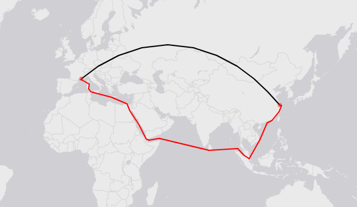

# searoute

[searoute]() is a Java library to compute shortest maritime route between two points.

See below an example from [Marseille (5.3E,43.3N)](https://www.openstreetmap.org/#map=10/43.3/5.3) to [Shangai (121.8E,31.2N)](https://www.openstreetmap.org/#map=10/31.2/121.8). The red line is the computed maritime route. The black line is the [great-circle route](https://en.wikipedia.org/wiki/Great-circle_distance).

