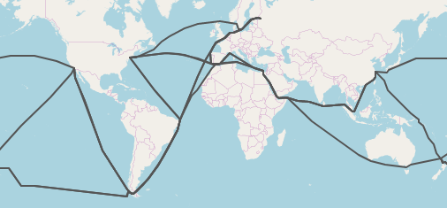
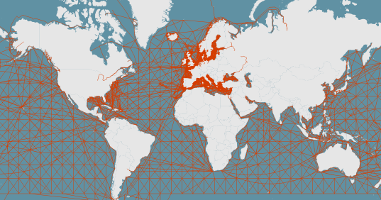

# SeaRoute

[](https://search.maven.org/search?q=g:%22eu.europa.ec.eurostat%22%20AND%20a:%22searoute%22)

[SeaRoute](https://github.com/eurostat/searoute) computes shortest maritime routes between two locations.

See below an example from [Marseille (5.3E,43.3N)](https://www.openstreetmap.org/#map=10/43.3/5.3) to [Shanghai (121.8E,31.2N)](https://www.openstreetmap.org/#map=10/31.2/121.8). The red line is the computed maritime route. The black line is the [great-circle route](https://en.wikipedia.org/wiki/Great-circle_distance).


## Usage

### As a program

[SeaRoute](https://github.com/eurostat/searoute) requires Java 1.9 or higher. Run `java --version` to check if Java is installed and what is the current version.

Download the lastest release [here](https://github.com/eurostat/searoute/raw/master/modules/jar/release/searoute.zip) and unzip it somewhere.

Examples of executions for windows users are provided in `searoute.bat` (for linux users, see `searoute.sh`). `test_input.csv` is an example of input file. It is a simple CSV file with origin/destination coordinates of the routes. Note that only geographical coordinates (decimal degrees) are supported. The output file is a [GeoJSON](https://geojson.org/) (\*.geojson) file. This file can be displayed with any modern GIS software such as [QGIS](https://qgis.org), or also with [geojson.io](http://geojson.io/). Each route has the same properties as the input CSV file, with three additional properties: 
- `distKM`, which is the length of the route, in KM
- `dFromKM` (respectivelly `dToKM`), which is the distance in KM between the origin (repectivelly destination) position and the closest node of the maritime network. This value measure the approximation arount the origin (respectivelly destination) position. The smaller, the better.

Run `java -jar searoute.jar -h` to see the help, with a description of all input parameters.



### For coders

[SeaRoute](https://github.com/eurostat/searoute) can be used as a Java library, which can be retrieved using [Maven](http://maven.apache.org/). For that, simply add it as a dependency to the *pom.xml* file:

```
<dependency>
	<groupId>eu.europa.ec.eurostat</groupId>
	<artifactId>searoute-core</artifactId>
	<version>X.Y</version>
</dependency>
```

Where *X.Y* is the current version number, as available [Maven central repository](https://search.maven.org/artifact/eu.europa.ec.eurostat/searoute).

For more information on how to setup a coding environment based on [Eclipse](https://www.eclipse.org/), see [this page](https://github.com/eurostat/README/blob/master/docs/howto/java_eclipse_maven_git_quick_guide.md).

Here is an example of shortest maritime route computation:

```java
//create the routing object
SeaRouting sr = new SeaRouting();

//get the route between Marseille (5.3E,43.3N) and Shanghai (121.8E,31.2N)
Feature route = sr.getRoute(5.3, 43.3, 121.8, 31.2);

//compute the route distance in km
MultiLineString routeGeom = (MultiLineString) route.getGeometry();
double d = GeoDistanceUtil.getLengthGeoKM(routeGeom);
```

For further overview, see [the documentation](https://eurostat.github.io/searoute/modules/core/doc/site/apidocs/index.html).

### As a webservice

To deploy [SeaRoute](https://github.com/eurostat/searoute) as a webservice (Java servlet), run:

```
git clone https://github.com/eurostat/searoute.git
cd modules/searoute-war
mvn clean package
```

and move the servlet `/target/searoute-XXX.war` into your `/tomcatX.Y/webapps/` folder. Go then to http://localhost:8080/searoute/ to see the REST-API documentation and some examples.

## Some additional information

The shortest maritime routes are computed from a network of lines covering the seas and following some of the most frequent martitime routes. This maritime network is based on the *Oak Ridge National Labs CTA Transportation Network Group, Global Shipping Lane Network, World, 2000* (retrieved from [geocommons.com](http://geocommons.com/datasets?id=25) or [github](https://github.com/geoiq/gc_data/blob/master/datasets/25.geojson)), enriched with some additional lines around the European coasts based on [AIS data](https://en.wikipedia.org/wiki/Automatic_identification_system). Simplified versions of this network have been produced for different resolutions (5km, 10km, 20km, 50km, 100km) based on a shrinking of too short edges and a removal of similar edges. For more detail on this generalisation algorithm, see the [marnet](/modules/marnet) module based on (JGiscoTools)[https://github.com/eurostat/JGiscoTools].

[](doc/img/marnet_overview.png)

[SeaRoute](https://github.com/eurostat/searoute) can be reused with custom maritime networks produced from some other custom maritime line datasets. The module [marnet](/modules/marnet) provides some utilities and examples for the creation and preparation of such maritime network datasets, with generalisation methods. To be able to handle channels, straits and passages such as *Suez* and *Panama* channels, the custom maritime sections need to be characterised with a new property *pass* set with the values *suez* and *panama* for the network sections passing by the Suez and Panama channels. The program will then be able to recognise them and possibly avoid them, on user request. The following straits, channels and passages are currently supported:
- Suez channel
- Panama channel

since version v3.5:
- Malacca strait
- Gibraltar strait
- Dover strait
- Bering strait
- Magellan strait
- Bab-el-Mandeb strait
- Kiel channel
- Corinth channel
- Northwest passage
- Northeast passage

The shortest maritime routes are computed from this network using the [Dijkstra's algorithm](https://en.wikipedia.org/wiki/Dijkstra%27s_algorithm) implemented in the wonderful [GeoTools](https://geotools.org/) library.

## Change log

### v3.5

08 Sep 2021
- Refinement of the maritime network dataset (marnet.gpkg) for all resolution.
- Inclusion of new straits/channels/passages. It includes now: Suez channel, Panama channel, Malacca strait, Gibraltar strait, Dover strait, Bering strait, Magellan strait, Bab-el-Mandeb strait, Kiel channel, Corinth channel, Northwest passage, Northeast passage.
- Reorganisation of the modules. There is now a new module "marnet" with the process to create multi-resolution networks.
- Various improvement of the network simplification algorithm.


## Support and contribution

Feel free to [ask support](https://github.com/eurostat/searoute/issues/new), fork the project or simply star it (it's always a pleasure). If anyone feels like helping fixing the existing issues, you are welcome !
